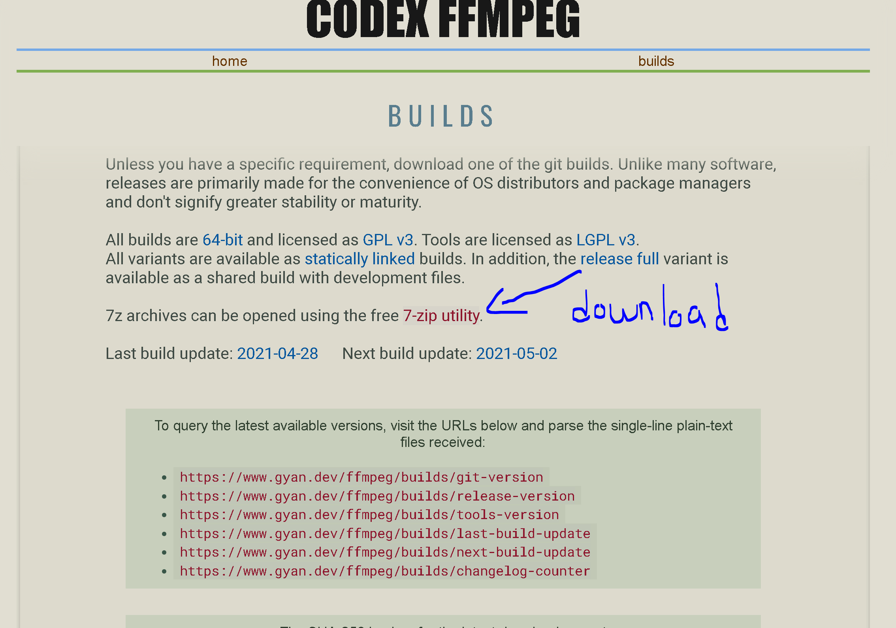
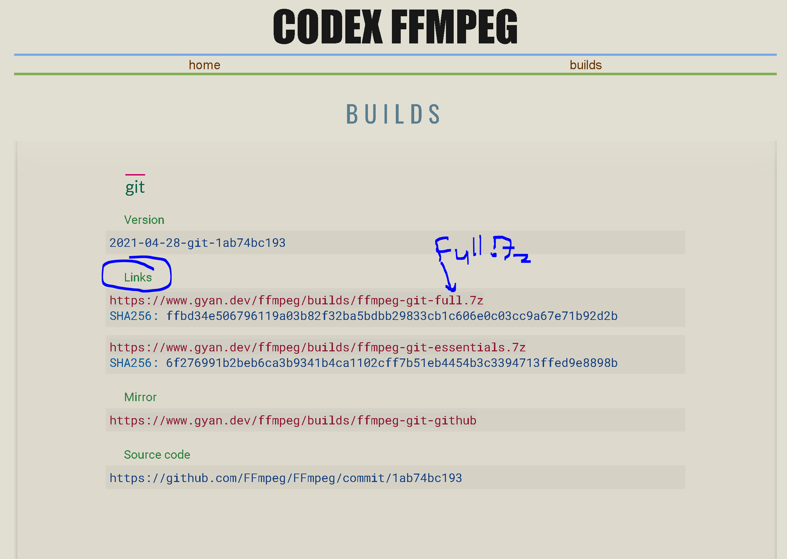
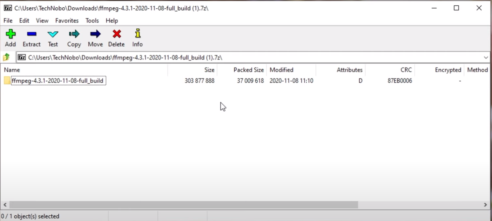
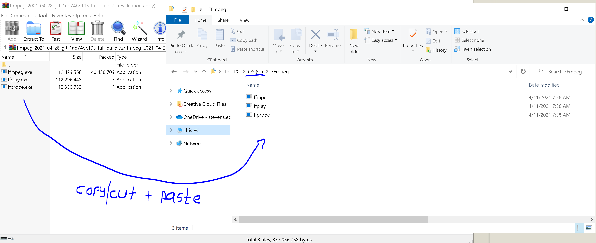
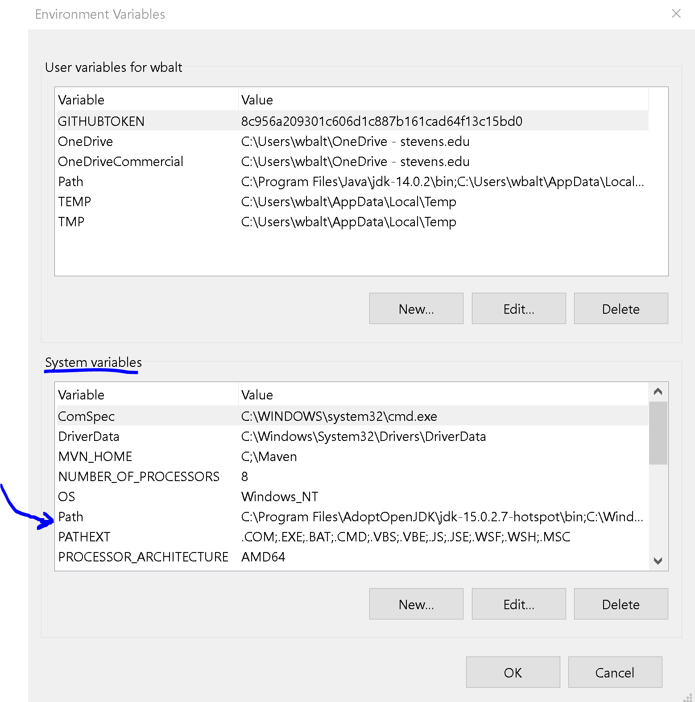
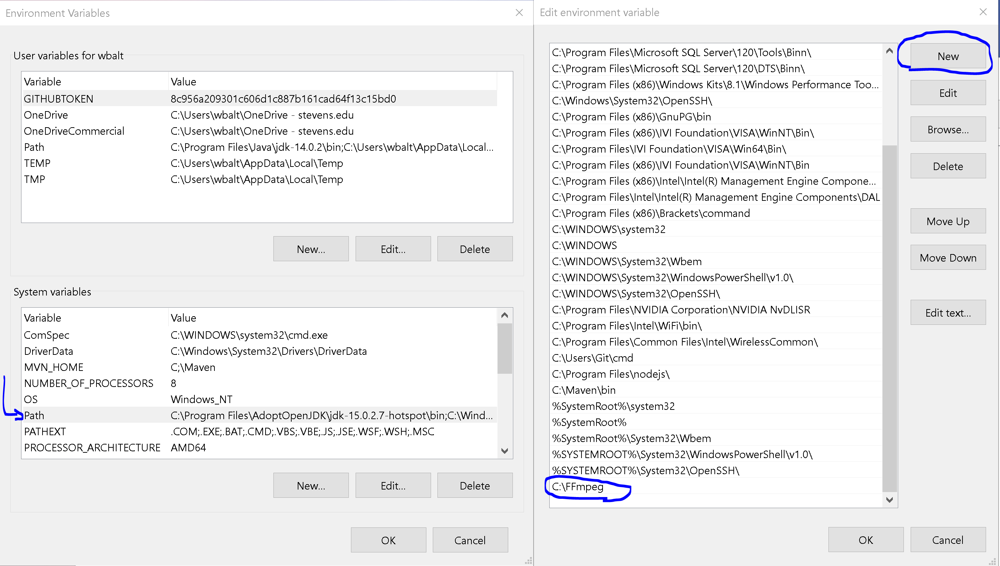
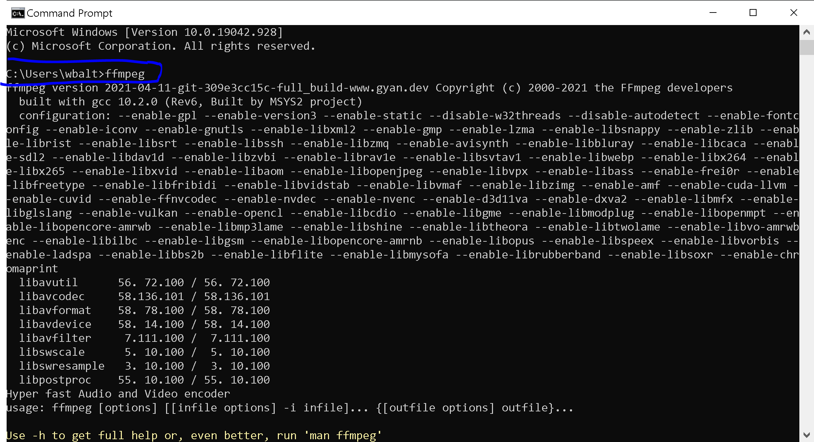

# SSW345- FocusBot Version: 1.0.1  

Jonathan Cucci: *joncucci*
- User Story: /createTask

William Baltus: *WilliamBaltus*
- User Story: /StartTask

Joseph Letizia: *josephletizia*
- User Story: /ShowTask

Markell Torres: *mtorres3*
- User Story: /FinishTask'

## Instructions for Running:

1. IDE: User choice  
2. Language: Python3.X  
3. Package manager: pip (install if you don't have it already)

### Crucial Dependencies and Packages to download/install:

1. Youtube_dl: this downloads a youtube video if provided a url
2. Discord.py Voice: voice commands for discord bot, does not install by default
3. FFMpeg: this converts a video into a format that discord can understand, think of it as an audio file compiler

#### Youtube_dl  
You can use a package manager, such as pip to get this. Simply run this command to install:
> pip install youtube_dl  
> pip install --upgrade youtube-dl  
You can learn more about it [Here](https://pypi.org/project/youtube_dl/)    

#### Discord.py Voice  
You can use a package manager, such as pip to get this. Simply run this command to install:
> pip install -U discord.py[voice]  

#### FFMpeg 
This is more complicated to install properly. Here are the steps I took. There are many different ways to do this FYI. 
1. The link to downlod ffmpeg is [Here](https://www.gyan.dev/ffmpeg/builds/)
2. When you arrive at the page, you will scroll down and see something like this. Download and install the 7-zip Utility, shown below.
    
3. Scroll down some more until you find this:  
    
4. Open the 7zip utility and open the ffmpeg folder you downloaded, it should look similar to this:
  
5. Open the folder and find the bin subfolder. 
6. Open the bin folder, there you will find a few .exe files. Those are the ffmpeg binaries. Drag this 7zip window to the side. 
7. Create a new folder in your drive. I created them in my C Drive. It is best to name the folder something easy as it will help you down the line. In my case, I named it "FFMPEG"
8. Now you want to select the .exe files in the 7zip and copy them over to the folder you made in the C drive. It may look similar to this:
  
 
#### Almost Done!
9. Next, you want your machine to know where to find these files. You want to edit your system environmental variables. 
>For a machine with WINDOWS OS
>Click the search icon and type in **path** and click _Edit the system environment variables_
>ON the pop up, at the bottom right, click **Environment Variables...**   

A pop up like this should show now (Don't worry if you have differeing variables and values, these shouldn't affect the process): 
    
10. Under System Variables double click the variable called **PATH** (if you want the machine to recognize these ffmpeg files under all users on your machine, otherwise find and double click **PATH** under _User variables for..._)  
11. Now click **NEW** and type in the path of the folder where you copied the FFMPEG .exe files and then press **OK**. In my case, the folder was named "FFMPEG" and it was on my C drive, so my path looked like this...
     
12. Click **OK** and you restart your machine! 

### Testing that FFMPEG is successfully installed
1. For WINDOWS OS: Open cmd prompt 
2. Type in 
>ffmpeg
3. You should have a bunch of text pop up similar to this
  

 

