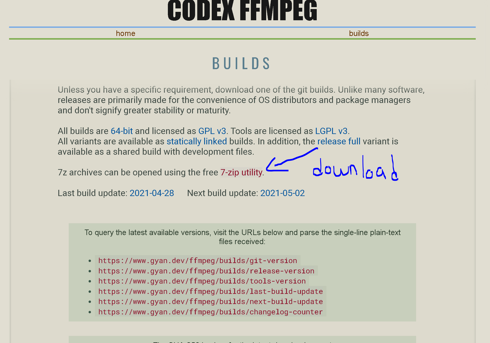
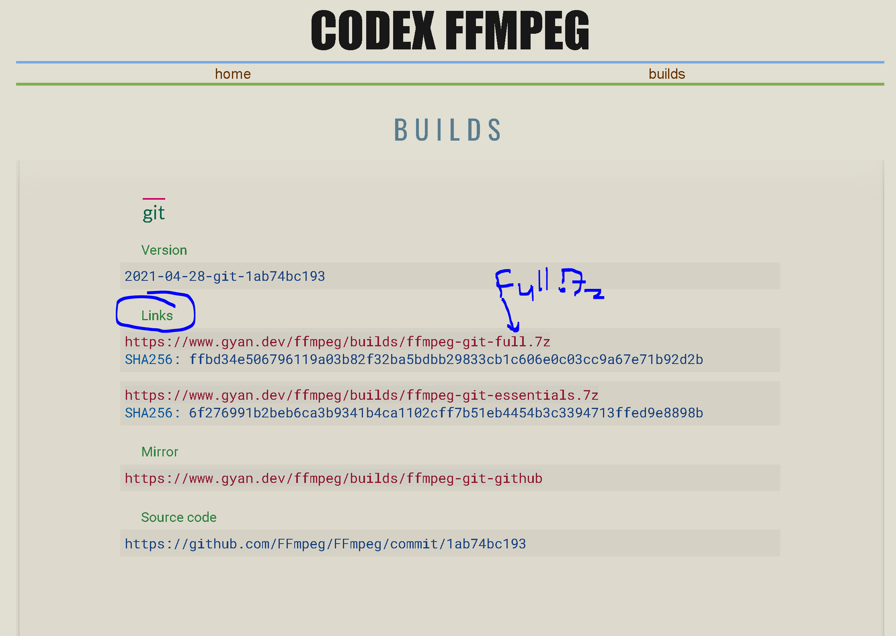

# SSW345- FocusBot Version: 1.0.1  

Jonathan Cucci: *joncucci*
- User Story: /createTask

William Baltus: *WilliamBaltus*
- User Story: /StartTask

Joseph Letizia: *josephletizia*
- User Story: /ShowTask

Markell Torres: *mtorres3*
- User Story: /FinishTask'

## Instructions for Running:

1. IDE: User choice  
2. Language: Python3.X  
3. Package manager: pip (install if you don't have it already)

### Crucial Dependencies and Packages to download/install:

1. Youtube_dl: this downloads a youtube video if provided a url
2. Discord.py Voice: voice commands for discord bot, does not install by default
3. FFMpeg: this converts a video into a format that discord can understand, think of it as an audio file compiler

#### Youtube_dl  
You can use a package manager, such as pip to get this. Simply run this command to install:
> pip install youtube_dl  
> pip install --upgrade youtube-dl  
You can learn more about it [Here](https://pypi.org/project/youtube_dl/)    

#### Discord.py Voice  
You can use a package manager, such as pip to get this. Simply run this command to install:
> pip install -U discord.py[voice]  

#### FFMpeg 
This is more complicated to install properly. Here are the steps I took. There are many different ways to do this FYI. 
1. The link to downlod ffmpeg is [Here](https://www.gyan.dev/ffmpeg/builds/)
2. When you arrive at the page, you will scroll down and see something like this. Download and install the 7-zip Utility, shown below.
    
3. Scroll down some more until you find this:  
  

